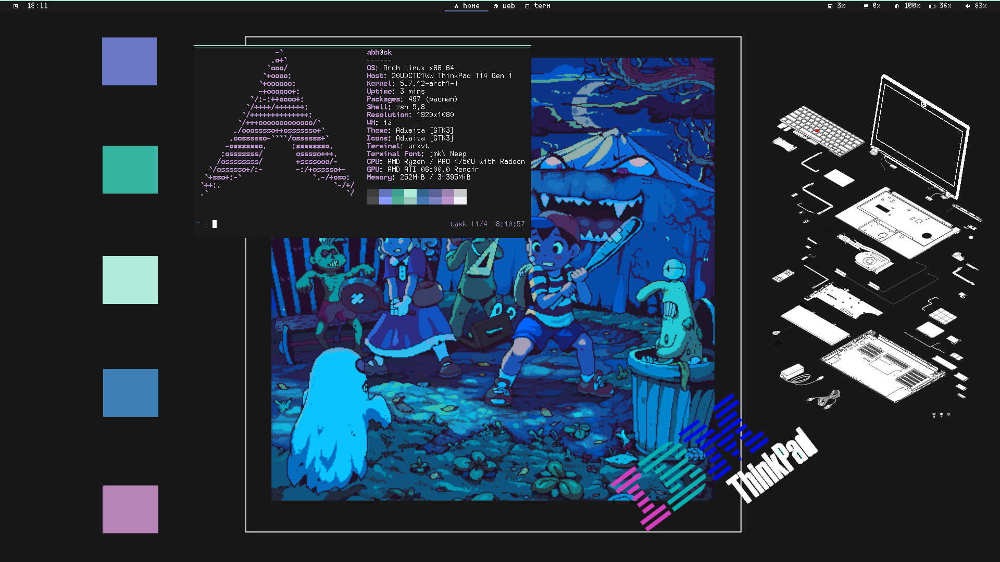

# dotfiles

## details :
- OS : Arch Linux (btw)
- WM : i3
- Bar : Polybar
- Terminal : Urxvt 
- Shell : ZSH
- Editor : Vim
- Terminal Font : Neep
- Bar Font : Scientifica
- Icon Font : Siji
- Music Player : spotify-tui + spotifyd
- Browser : firefox 
- File Manager : Ranger
- Notification : Dunst
- Screen Capture : Scrot
- Monitoring : htop
- Document : Zathura
- App Launcher : Dmenu
- Password manager : pass

## screenshot :

